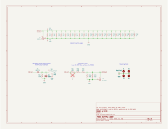
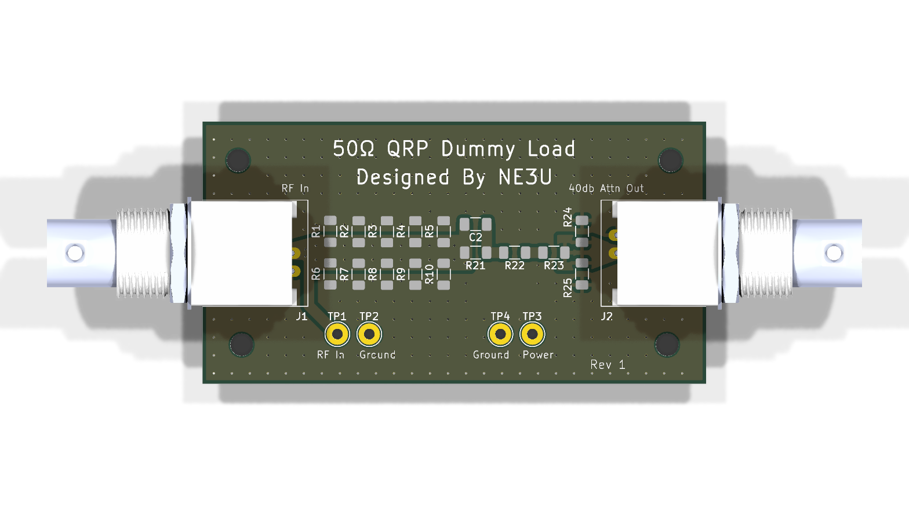

# DummyLoad

KiCad project for a 50 ohm RF dummy load board with integrated attenuation and rectified measurement output.

## Overview

This repository contains the schematic, PCB, custom footprint library, and generated manufacturing artifacts for the DummyLoad board.

From the schematic title block and notes:
- Design target: 50 ohm dummy load
- Rated power (design intent): 10 W
- Includes attenuation network:
  - Note in schematic: "40db Attenuation (use 3x 261 Ohm resistors for 30db)"
- Includes a rectified voltage measurement point for RF power estimation

## Schematic

## PCB

## Main Files

- `DummyLoad.kicad_sch`: KiCad schematic
- `DummyLoad.kicad_pcb`: KiCad PCB layout
- `DummyLoad.kicad_pro`: KiCad project
- `MiscFootprints.pretty/`: Local footprint library used by this project
- `output/`: Generated artifacts (BOM, schematic PDF, Gerbers, drill files)
- `.github/workflows/kicad.yml`: CI workflow for ERC/DRC and artifact generation

## Connectors and Test Points

- `J1`: RF In (BNC horizontal)
- `J2`: RF Out (BNC horizontal)
- `TP1`: Power Out (rectified measurement output)
- `TP2`: GND

## Bill of Materials

A generated BOM is committed at:
- `output/bom.csv`

The CI workflow exports BOM fields:
- Reference
- Value
- Footprint
- Quantity
- DNP
- Mouser PN
- Datasheet

## Generated Manufacturing Outputs

When CI succeeds, generated files are updated in:
- `output/schematic.pdf`
- `output/bom.csv`
- `output/gerbers/`

These include copper, mask, silkscreen, fab, edge cuts, and drill outputs.

## CI / Automation

GitHub Actions workflow: `.github/workflows/kicad.yml`

It runs on pushes and pull requests to `main` (ignoring changes under `output/**`) and can also be triggered manually.

The workflow performs:
1. KiCad ERC
2. KiCad DRC
3. Schematic PDF export
4. BOM export
5. Gerber and drill export
6. Commit updated generated outputs on `main`
7. Upload production artifacts

## Working With the Project Locally

1. Open `DummyLoad.kicad_pro` in KiCad.
2. Ensure the local footprint library is available:
   - `MiscFootprints.pretty`
3. Run:
   - Schematic Editor ERC
   - PCB Editor DRC
4. Generate fabrication outputs from KiCad if needed.

## Safety and Validation Notes

This project handles RF power dissipation. Before physical use:
- Verify resistor power dissipation and thermal limits for your operating conditions.
- Validate attenuation and measurement calibration on your target frequency range.
- Confirm connector, PCB copper, and assembly choices meet your power and duty-cycle requirements.

## License

MIT. See `LICENSE`.
